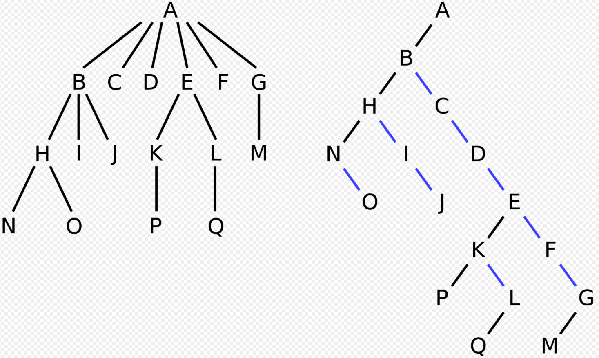
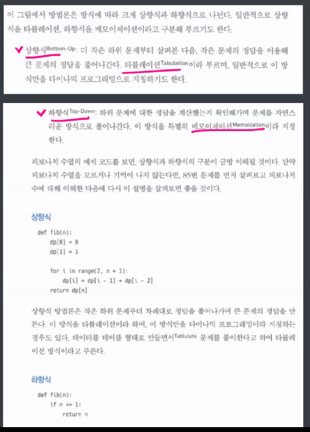
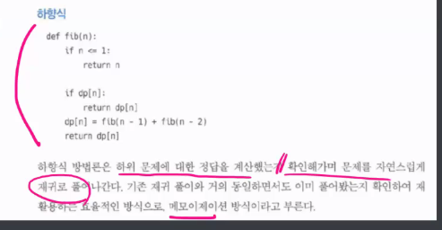
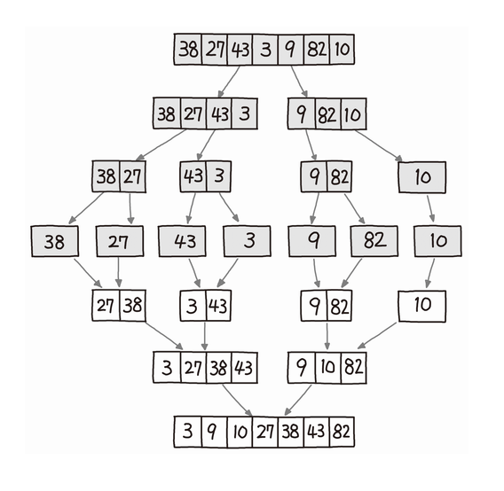
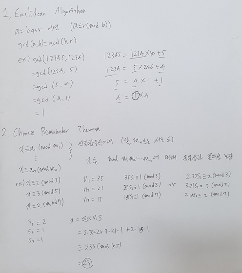

# Algorithm

[TOC]

## 자료구조

### 스택

pop() : 맨위원소 반환하면서 제거, 파이썬엔 리스트 메소드로 있음

push() : 스택에 원소 집어넣음, append()

top() : 맨 위에 있는 수 출력, list[-1], 비어있으면 -1 출력

isEmpty() : 비어있으면 1, 아니면 0 출력

size() : 스택 크기 출력, 파이썬엔 len()


#### Stack-후위표기법 계산기

**후위표기법으로 만들기**

1. 토큰을 하나씩 순회
2. 숫자는 출력
3. 토큰의 우선순위가 높으면 출력, 그렇지 않다면 토큰이 더 커질때까지 top을 결과에 붙여나감

4. 토큰이 )면 (를 만날때까지 top을 결과에 붙여나가다가, )과 서로 상쇄시킴
5. 계속 반복한 후 남아있는 연산자 모두 붙임

**계산기**

숫자->push

연산자->스택에서 pop 두번 하여 연산 후 push

| 토큰 | isp  | icp  |
| :--: | :--: | :--: |
|  )   |  -   |  -   |
| *, / |  2   |  2   |
| +, - |  1   |  1   |
|  (   |  0   |  3   |

permutation

```python
def perm(i):
    if i == len(p):
        print(p)
    else:
        for j in range(i, len(p)):
            p[i], p[j] = p[j], p[i]  # swap
            perm(i + 1)
            p[i], p[j] = p[j], p[i]


p = [1, 2, 3]

perm(0)
```


### 큐

push() : 원소 집어넣음, append()

pop() : 가장 앞에있는 원소 반환하면서 제거, .pop(0)

size() : len()

isEmpty() : 비어있으면 1, 아니면 0 출력

front() : 가장 앞에 있는 수 출력, list[0], 비어있으면 -1출력

back() : 가장 뒤에 있는 수 출력, list[-1], 비어있으면 -1 출력


### 덱

`from collections import deque`

push_front() : .appendleft()

push_back() : .append()

pop_front() : .popleft()

pop_back() : pop()

size() : len

isEmpty() : 

front() : 인덱싱 가능

back() : 인덱싱 가능

1. 리스트처럼 insert, remove, indexing도 가능
2. extend, extendleft, rotate 도 있음 파이썬엔
3. reverse도있음


### 트리

모든 트리는 left-child right-sibling을 통해 2진 트리로 나타낼 수 있으므로, 트리의 기본은 2진 트리

- 정 이진 트리(full binary tree) : 모든 자식이 0개나 2개

- 포화 이진 트리(perfect binary tree) : 모든 리프 노드가 아닌 노드는 2개의 자식을 갖는 트리

- 완전 이진 트리(complete binary tree) : 마지막 레벨 바로 전까지는 꽉 차있어서, 리프의 높이가 최대 1 차이 나고 모든 노드의 오른쪽 자식이 있으면 왼쪽 자식이 있는 트리, 다시 말해서 왼쪽부터 오른쪽까지 채워나간 형태

 

순회 방법

- 중위 순회 : 왼쪽 자손-자신-오른쪽 자손 순서로 방문, 중위 순회하면 정렬된 결과를 얻을 수 있음
- 전위 순회 : 자신-왼쪽 자손-오른쪽 자손 순서로 방문->root에서 시작하는 DFS
- 후위 순회 : 왼쪽 자손-오른쪽 자손-자신 순서로 방문->아래에서 위로 올라감(Symmetric)
- 레벨 순서 순회 : 레벨 순서로 방문. 위의 세개는 스택을 활용하여 구현하는 반면 레벨 순서 순회는 큐를 활용해 구현할 수 있음.


#### 이진 트리

일반적으로 자식 갯수 제한은 없지만, 자식 갯수가 n>2개인 트리에서 left-child right-sibling 방법을 사용하면 equivalent한 이진 트리를 구성할 수 있으므로, 특별한 이유 없는 한 웬만한 트리는 이진트리로 구성



정 이진트리 : 모든 노드의 자식이 0개 혹은 2개

완전 이진트리 : 왼쪽에서 오른쪽으로 채운 형태, 모든 리프의 차이는 커봐야 1이고, 모든 노드는 오른쪽 자식을 갖는다면 왼쪽 자식도 가짐. 인덱스로 부모자식관계를 바로 파악할 수 있고, 공간의 낭비도 별로 없어서 리스트로 표현하기 매우 좋음

포화 이진트리 : 완전 이진트리 중 level n까지 꽉채워서, 노드의 갯수가 2^n-1이 되는 것


배열로 표현하면 쉽고 편하지만, 특정한 경우 메모리를 매우 심하게 낭비할 수 있다. 가령 1,2,3,....,10000 같은걸 이진탐색트리로 저장하는 경우를 배열로 만들려고 하면 인덱스가 2^10000까지 필요함.


#### 이진트리의 순회

전위 순회 : Root-Left-Right

중위 순회 : Left-Root-Right

후위 순회 : Left-Right-Root


#### 이진 탐색 트리

이진 트리의 일종으로, 노드의 왼쪽에는 노드보다 작은 값만 있고 노드의 오른쪽에는 노드보다 큰 값만 있음. 어떤 노드를 잡더라도 subtree는 이진 탐색 트리가 됨. 이진 탐색 트리를 중위순회 하면 정렬된 결과를 얻을 수 있음. 적당히 랜덤하게 배열된 값들을 받는다면 탐색/삽입/삭제에 O(logN)이 걸림. 그러나 이미 정렬된 값들을 받는다면 O(N)이 되어 비효율적일 수 있음.

최악의 상황에서도 탐색/삽입/삭제에 O(logN)이 걸린다는 red-black tree라는게 있다고는 하는데, 이런걸 자꾸 보면 벽이 느껴지죠...


#### 힙 트리

완전 이진 트리의 일종, 부모의 값은 항상 자식의 값보다 큼. 대소관계는 딱 부모와 자식 사이에서만 성립함. 완전 이진트리이므로 배열로 표현하기 편리함(heapq 써도 편리하겠지만). 최댓값/최솟값을 탐색하는데 O(1)이 걸림. 삽입과 삭제는 O(logN)

삽입 : 완전이진트리의 마지막 자리에 삽입하고, 부모가 더 작다면 부모와 스왑하여 올리면 됨

삭제 : 루트 자리만 삭제할 수 있음. 루트를 제거하고, 마지막 노드를 루트로 올림. 자식보다 크다면 이대로 끝이고, 아니라면 둘 중 큰 자식과 교환하며 내려감

## 알고리즘

이진탐색

upperbound, lowerbound


카프-라빈 알고리즘

KMP 알고리즘

보이어-무어 알고리즘 horspool 알고리즘


### 패턴검색

1. 브루트포스

   ```python
   pattern="is"
   text="This is a book"
   M=len(pattern) # 2
   N=len(text) # 14
   
   def BruteForce(pattern, text):
       j=0
       i=0
       while j<M and i<N:
           if text[i] != pattern[j]:
               i = i-j
               j = -1
           i = i+1
           j = j+1
       if j==M : return i-M # 검색 성공(j=M이 되어 루프 빠져나온경우)
       else: return -1 # 검색 실패(i=N이 되어 루프 빠져나온경우)
   ```

   

### DP






### 분할정복

크고 아름다운 문제를, 더이상 분할할 수 없을 때까지 동일한 유형의 하위 문제로 나누고(분할), 가장 작은 단위의 하위 문제를 해결(정복), 하위 문제의 결과를 원래 문제에 대한 결과로 조합한다.

보통은 재귀로 구현한다. 파이썬의 재귀는 매우 느리므로 약간 손해보는 기분이다.


**퀵소트**

1. 피벗을 정해서
2. 피벗보다 작은건 왼쪽으로, 큰건 오른쪽으로 보냄
3. 반으로 나누어진 각각의 배열에 대해 1-2를 반복
4. 배열의 크기가 1이 될때까지 진행


시간복잡도 평균적으로 nlogn, 다른 nlogn인 정렬보다 훨씬 빠르게 작동한다. 그러나 최악의 경우 O(n^2). 불안정 정렬이다.

```python
def quicksort(x):
    if len(x) <= 1:
        return x

    pivot = x[len(x) // 2]
    less = []
    more = []
    equal = []
    for a in x:
        if a < pivot:
            less.append(a)
        elif a > pivot:
            more.append(a)
        else:
            equal.append(a)

    return quicksort(less) + equal + quicksort(more)
```

피벗을 정하는 방법에 배리에이션이 매우 많고, 중간값을 정하는 방법, 랜덤하게 정하는 방법, 중간에 위치한 값을 정하는 방법, 배열 중에서 몇 개를 골라서(보통 왼쪽끝, 중간, 오른쪽끝) 그들 중 중간값으로 하는 방법 등이 있는데 각자 유리한 상황 불리한 상황이 있지만, n^2이 걸리는 요상한 입력을 주는건 진짜 어렵다고 하므로 어느정도는 믿고 써도 되는듯? 보통 배열의 중간에 위치한 값을 정하는 방법이 쉽고 편하다.


**머지소트**



우리의 본능이 이해하는 그림.jpg

O(nlogn), stable sort, 평균적인 상황에서는 퀵소트보다 느리다.

```python
def merge_sort(arr):
    if len(arr) < 2:
        return arr

    mid = len(arr) // 2
    low_arr = merge_sort(arr[:mid])
    high_arr = merge_sort(arr[mid:])

    merged_arr = []
    l = h = 0
    while l < len(low_arr) and h < len(high_arr):
        if low_arr[l] < high_arr[h]:
            merged_arr.append(low_arr[l])
            l += 1
        else:
            merged_arr.append(high_arr[h])
            h += 1
    merged_arr += low_arr[l:]
    merged_arr += high_arr[h:]
    return merged_arr
```


### Union Find

```python
def union(x,y):
    a=find(x)
    b=find(y)

    parent[max(a,b)]=min(a,b)
```

```python
def find(x):

    if parent[x]!=x:
        parent[x]=find(parent[x])

    return parent[x]
```

시간복잡도 : union->find함수의 시간복잡도와 동일

find->

경로압축 없으면 최악의 경우 O(N)

경로압축 있으면 각각의 연산은 O(N)이지만, M번의 find 연산을 수행하는 데 평균시간은 O(MlogN)으로 평균 O(logN)

Rank 배열 사용하면 O(logN)

경로압축, rank배열 모두 사용하면 ~O(1)


**사이클 판별**

방향 그래프의 사이클 판별은 DFS로 해야함(finished 배열 만들어서)

''무''방향 그래프의 사이클은 유니온파인드로 가능. DFS/BFS로도 물론 가능


### 최소신장트리

#### 1. 크루스칼 알고리즘

1. 간선을 크기가 작은 순으로 정렬함
2. 정렬된 간선을 하나씩 선택
3. 간선을 이루는 두 노드의 부모가 같다면 사이클이 형성되는 것이므로 버림
4. 부모가 같지 않다면 유니온 해주고, 전체 비용에 추가

```python
def union(x,y):
    a=find(x)
    b=find(y)

    parent[max(a,b)]=min(a,b)

def find(x):
    if parent[x] != x:
        parent[x] = find(parent[x])

    return parent[x]

V,E=map(int,input().split())
parent=[i for i in range(V+1)]

graph=[]

for _ in range(E):
    u,v,w=map(int,input().split())
    graph.append([u,v,w])

graph.sort(key=lambda x:x[2]) # O(ElogE)

ans=0
for start,end,cost in graph: # E번 반복
    if find(start)!=find(end): # find함수, union함수 모두 평균 시간복잡도 O(logV)
        union(start,end)
        ans+=cost

print(ans)
```

정렬의 시간복잡도 ElogE, E번 반복하며 find함수를 최대 3회 호출하는 부분 3*ElogV 이므로 크루스칼 알고리즘의 시간복잡도 O(ElogE)=O(ElogV) (V-1<=E<V^2) 


#### 2. 프림 알고리즘

1. 그래프에서 하나의 꼭짓점을 선택하여 시작
2. 트리와 연결된 변 가운데 사이클을 만들지 않는 가장 가중치가 작은 변을 트리에 추가한다.
3. 연결된 변의 갯수가 V-1이 될때까지 반복

```python
import heapq
V,E=map(int,input().split())
graph=[[] for _ in range(V+1)]

for _ in range(E):
    u,v,w=map(int,input().split())

    graph[u].append([w,v])
    graph[v].append([w,u])

def prim(start):
    visited=[0]*(V+1)
    q=[[0,start]]
    ans=0
    cnt=0

    while cnt<V:
        cost,node=heapq.heappop(q) # heappop 시간복잡도 O(logV), V번 실행됨

        if visited[node]:
            continue

        visited[node]=1
        ans+=cost
        cnt+=1

        for w,v in graph[node]:
            heapq.heappush(q,[w,v]) # heappush 시간복잡도 O(logV), E번 실행됨

    return ans

print(prim(1))
```


시간복잡도 다익스트라와 같음

1. 인접행렬+탐색을 사용한 경우(수업시간에한코드) O(V^2)
2. **이진힙과 인접리스트를 사용한 경우 O((V+E)logV)=O(ElogV)**

3. 피보나치 힙을 사용한 경우 O(E+VlogV)


3. **비교**

별 차이 없다

간선이 많은 경우는 프림이 좀 더 유리하고, 간선이 성긴 경우에는 크루스칼이 좀 더 유리하다


### 위상정렬

위상 정렬 : Directed Acyclic Graph, 그래프의 방향을 거스르지 않게 정렬하기


진입차수가 0이다? -> 선수과목이 없다

1 2 반복

1. 진입차수가 0인 모든 노드를 큐에 넣는다
2. 큐에서 원소를 꺼내 해당 노드에서 진출하는 간선을 제거한다.

 결과적으로 각 노드가 큐에 들어온 순서가 위상정렬을 수행한 결과와 같음

답이 여러개일 수 있음, 모든 원소를 방문하기 전에 큐가 빈다면 **사이클이 존재**한다고 판단할 수 있음

```python
from collections import deque

V,E=map(int,input().split())

indegree=[0]*(V+1)

graph=[[] for _ in range(V+1)]

for _ in range(E):
    a,b=map(int,input().split())
    graph[a].append(b)

    indegree[b]+=1

def topological_sort():
    result=[]
    q=deque()

    for i in range(1,V+1):
        if indegree[i]==0:
            q.append(i)
    while q:
        
        now=q.popleft()
        result.append(now)
        
        for i in graph[now]:
            indegree[i]-=1
            if indegree[i]==0:
                q.append(i)
    print(*result)

topological_sort()
```


### Euclidean & CRT


