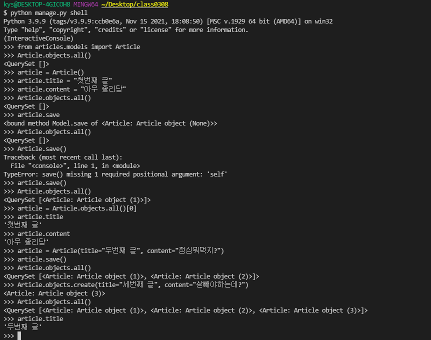

# Django

[TOC]

## TIL_0302

1. 가상환경 생성 및 활성화

   `python -m venv venv`

   `source venv/Scripts/activate`

   `pip list`

2. django 설치

   `pip install django==3.2.12`

3. 프로젝트 생성

   `django-admin startproject firstpjt .`

4. 앱 생성하기

   `python manage.py startapp articles`

5. 서버 시작하기

   `python manage.py runserver`


프로젝트 구조 중 settings.py, urls.py 만 만질 예정

articles 에서는 admin, models, views 만 만질 예정


프로젝트에서 앱을 사용하기 위해서는 프로젝트에 앱을 추가해야함

로컬앱-서드파티앱-장고앱 순서로 등록해야함


기본 작업순서 : urls-views-templates

앱 새로 만들면 조건반사로 settings.py에 등록


STATIC_ROOT : 개발 과정에서는 작동안함, 나중에 배포때 등장함

STATICFILES_DIRS

STATIC_URL

Static은 builtin 아니므로, load를 선언하고 써야함 ``


## TIL_0308

MODEL!

MTV의 M을 담당하고 있다

뭔가 데이터베이스 관련된거 하는 곳임


ORM

객체관계매핑

python으로 SQL을 감싸서 SQL안쓰고 python으로 데이터베이스를 조작


마이그레이션

python manage.py makemigrations

python manage.py migrate

python manage.py sqlmigrate articles 0001

python manage.py showmigrations




**Create**

1. 인스턴스를 만들고 save하는 방법

   article=Article()

   article.title="asdf"

   article.save()

2. 키워드 인자를 넘기는 방식

   article = Article(title="asdf")

   article.save()

3. create() 이용하는 방법

   Article.objects.create(title="asdf")

   save() 가 필요 없다

**Read**

모든 데이터 조회 : Article.objects.all()

한개 데이터 조회 : Article.objects.get() 보통 pk/id 로 찾음

조건에 맞는 데이터 조회 : Article.objects.filter()

**Update**

인덱싱으로하면됨

**Delete**

article.delete()


## TIL_0319

TEMPLATES = [

{

'DIRS':[BASE_DIR/'templates'],

}

]

LANGUAGE_CODE = 'ko-kr'

TIME_ZONE = 'Asia/Seoul'


message=request.GET.get('name')


path('intro/\<str:name\>/\<int:age\>', views.intro, name='intro')

->이렇게 쓰려면 view가 (request, name, age) 를 받아야함


class Article(models.Model):

  title = models.CharField(max_length=30)

  content = models.TextField()

  created_at = models.DateTimeField(auto_now_add=True)

  updated_at = models.DateTimeField(auto_now=True)


##### Create

1. 인스턴스를 만들고 save하는 방법

   article=Article()

   article.title="asdf"

   article.save()

2. 키워드 인자를 넘기는 방식

   article = Article(title="asdf")

   article.save()

3. create() 이용하는 방법

   Article.objects.create(title="asdf")

   save() 가 필요 없다

##### Read

모든 데이터 조회 : Article.objects.all()

한개 데이터 조회 : Article.objects.get() 보통 pk/id 로 찾음

조건에 맞는 데이터 조회 : Article.objects.filter()

##### Update

인덱싱으로하면됨

##### Delete

article.delete()


python manage.py createsuperuser

```
from .models import Article

class ArticleAdmin(admin.ModelAdmin):
	list_display=('pk','title','content','created_at','updated_at')


admin.site.register(Article)
```


DTL

 : 리스트가 비어있다면


## TIL_0414

첫 마이그레이션 진행하기 전에 무지성으로 커스텀 유저 모델을 설정해야 한다.

1. settings.py 아래 AUTH_USER_MODEL = 'accounts.User'

2. accounts/models.py에

   ```python
   from django.contrib.auth.models import AbstractUser
   
   class User(AbstractUser):
       pass
   ```

3. admin.py에

   ```python
   from django.contrib.auth.admin import UserAdmin
   from .models import User
   
   admin.site.register(User,UserAdmin)
   ```

   

(4) models.py에서는 model을 이렇게 넘겨줘야해, settings.AUTH_USER_MODEL

다른데서는 user_get_model()로 하면 됨


## TIL_0421

서버 는 웹서버랑 API서버로 나뉘어짐

서버가 뭔데? : 요청을 하면 응답을 해주는 전세계 어딘가에 있는 컴퓨터

웹서버 : 리퀘스트가 왔을 때 웹페이지를 리스폰스의 바디에 담아서 반환

API 서버 : 리퀘스트가 왔을 때 요청한 것 처리, 그 결과를 리스폰스의 바디에 담아서 반환


HTTP의 특성

1. 비연결성(Connectless) : 클라이언트와 서버가 한 번 응답을 주고 받으면, 연결을 끊는다.
2. 무상태(Stateless) : 서버가 클라이언트를 기억하지 못함.

너무 불편해서 쿠키와 세션이등장함


https://www.example.com:80/path/to/myfile.html/?key=value#quick-start

scheme, host, port, path, query, fragment


RESTful?

1. URL은 리소스를 나타내기 위해서만 사용하고, 리소스에 대한 처리는 메서드로 표현한다

2. Document는 단수명사로, Collection은 복수 명사로 표현한다


Response 함수의 safe=True이면 dict만 데이터로 허용, False면 다른 자료형

Serializer 의 many=True 옵션, 단일객체 아니라 쿼리셋 줄 때

다른 클래스에서 가져오면 read_only=True 

test

## TIL_0517

pip install django djangorestframework

pip install django-cors-headers

pip install django-allauth

pip install dj-rest-auth
