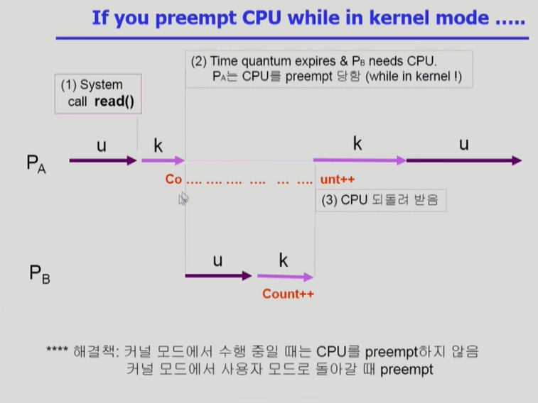
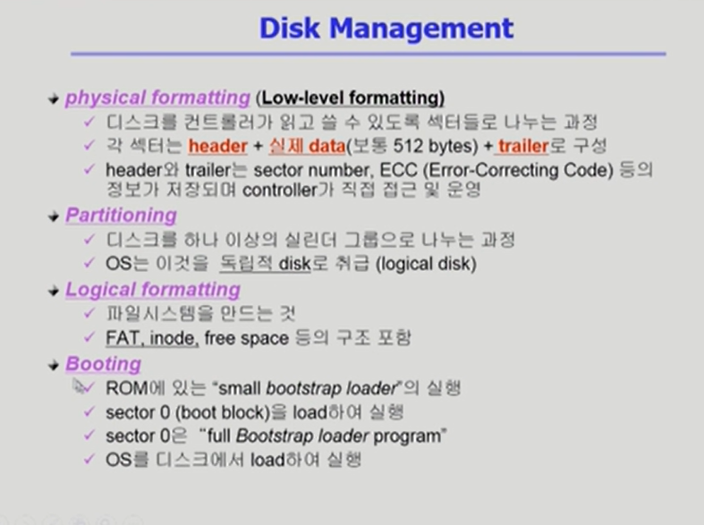

# Operating System

Reference : http://www.kocw.net/home/search/kemView.do?kemId=1046323

[TOC]

# Chapter 1. Introduction to Operation Systems

OS : 협의의 운영체제(커널) : 운영체제의 핵심 부분으로 메모리에 상주하는 부분

​		광의의 운영체제 : 커널 뿐 아니라 각종 주변 시스템 유틸리티를 포함한 개념


운영체제의 목적 : 자원을 효율적으로 관리, 사용자로 하여금 편리하게 사용할 수 있게 해줌


운영체제의 분류 

 1. 동시 작업 가능 여부 : 싱글태스킹 vs 멀티태스킹

 2. 사용자의 수 : 단일사용자(single user) vs 다중사용자(multi user)

 3. 처리 방식 : 일괄처리(batch processing) vs 시분할(time sharing) vs 실시간(realtime)

    **시분할 방식은 데드라인을 보장하지는 않음, 사람이 많으면 동작 느려짐**

    실시간? 정해진 시간안에 어떤 일이 반드시 종료됨이 보장되어야 함


# Chapter 2. System Structure & Program Execution

## System Structure

운영체제를 설명하기에 앞서 하드웨어에 대해 설명


cpu : 매 클럭마다 메모리에서 instruction을 읽어서 수행하는 일만 계속함

register : 메모리보다 빠르면서 정보를 저장할 수 있는 작은 공간

​	program counter register도 여기에 있음

mode bit : 지금 실행되는게 운영체제(0)인지(=커널모드, 시스템모드, 모니터모드) 사용자 프로그램(1)(=사용자모드) 인지

mode bit이 0일때는 cpu는 뭐든지다할수있음, 1일때는 제한된 동작만 가능(I/O 접근은 안됨)

인터럽트 라인 : CPU는 메모리랑만 노는데, 다른 애가 일 끝냈는지 알려고

​	cpu는 매 인스트럭션을 수행할 때 마다 인터럽트 라인을 체크함

​	인터럽트가 걸리면 기본적으로 cpu가 os에게 넘어감

타이머 : 일정 시간간격마다 인터럽트를 걸어줌. cpu 독점을 방지하기 위해서.


device controller : IO device에는 전담하는 작은 cpu가 붙어 있음

local buffer : device controller의 작업 공간, I/O는 device와 local buffer 사이에서 일어남


시스템콜 : 사용자 프로그램이 운영체제의 서비스를 받기 위해 인터럽트 라인을 세팅하고(소프트웨어 인터럽트) 커널 함수를 호출하는 것<->하드웨어 인터럽트(by I/O)


DMA(Direct Memory Access) : IO 장치에 의해 인터럽트가 너무 자주 걸려서 생기는 비효율을 방지.

device controller가 buffer storage의 내용을 메모리에 block 단위로 전송, 바이트 단위가 아니라 블록 단위로 인터럽트를 발생하도록 함

cpu도, dma controller도 메모리에 접근할 수 있으므로 이를 memory controller가 중재하는 역할


사용자 프로그램이 I/O를 요청하는 방법(=운영체제의 서비스를 받기 위해 커널 함수를 호출)

mode bit을 0으로 바꾸고 interrupt를 건다. 이를 system call이라고 한다. 이러한 interrupt를 또 다른 말로 소프트웨어 인터럽트 혹은 trap 이라고 부른다.

(참고 : 타이머, IO 컨트롤러 인터럽트 등을 하드웨어 인터럽트라고 한다)

I/O를 위해서는 두 가지 interrupt가 모두 걸림 : I/O 요청 -> trap, I/O 완료 -> interrupt


## Interrupt

인터럽트 당한 시점의 레지스터와 program counter를 save한 후, CPU의 제어를 인터럽트 처리 루틴에 넘기게 됨

Interrupt vector : 해당 인터럽트의 처리 루틴 주소를 가지고 있음

Interrupt Service Routine(=인터럽트 처리 루틴, 인터럽트 핸들러) : 해당 인터럽트를 처리하는 커널 함수


Interrupt의 종류 : interrupt(하드웨어), trap(소프트웨어)

​	trap의 예시 : Exception, system call

키보드 컨트롤러가 interrupt를 걸면, local buffer의 내용을 memory에 복사하고, 키보드 I/O를 요청했던 프로세스에는 CPU를 얻을 수 있다고 알려야함

Timer가 interrupt를 걸면, CPU를 뺐어서 다른 프로레스에 넘겨야함


## 동기식 입출력과 비동기식 입출력

- 동기식 입출력 (synchronous I/O)
  - I/O 요청 후, 입출력 작업이 완료된 후에야 제어가 사용자 프로그램에 넘어감
  - 구현 방법1
    - I/O가 끝날 때까지 한 프로그램에서 CPU를 점유하여 낭비시킴
    - 매 시점 하나의 I/O만 일어날 수 있음
  - 구현 방법2
    - I/O가 완료될 때까지 해당 프로그램에게서 CPU를 뺐어 다른 프로그램에 넘김
    - I/O 처리를 기다리는 프로그램들을 줄세움
- 비동기식 입출력 (asynchronous I/O)
  - I/O가 시작된 후 입출력 작업이 끝나기를 기다리지 않고 제어가 사용자 프로그램에 즉시 넘어감
- 두 경우 모두 인터럽트를 통해 I/O가 끝났음을 알림


## 프로그램의 실행 (메모리 load)


- File system에 저장되어있는 프로그램의 실행파일을 실행하면, 그 프로그램 만의 독자적인 주소 공간이 생김
  - 주소 공간은 아래의 영역으로 구성됨
    - code
      - CPU에서 실행할 기계어 저장
    - data
      - 프로그램이 사용할 변수 등의 자료구조 저장
    - stack
      - 함수를 호출하고 리턴할 때 데이터를 저장
  - 이 주소 공간 전체를 실제 메모리에 올리면 메모리가 낭비됨
    - 당장 필요한 부분만 메모리에 올림
      - 메모리에 올라간 코드가 필요없으면 버리거나, 하드디스크를 메인 메모리의 연장선으로 사용하는 swap area에 넘김
    - 이런 특성 때문에 Virtual memory라고 부름
    - 하드웨어의 도움을 받아 가상 메모리의 주소를 실제 메모리 주소로 변환(=address traslation)해주는 계층 존재


## OS 커널 주소 공간의 내용

- code

  - 커널 코드
    - 시스템 콜, 인터럽트 처리 코드
    - 자원 관리를 위한 코드
    - 편리한 서비스 제공을 위한 코드

- data

  - 하드웨어를 관리하고 통제하기 위해 OS가 사용하는 자료구조
  - 각 프로그램을 관리하기 위한 자료 구조 (PCB)

- stack

  - 사용자 프로그램 마다 커널 스택을 별도로 둠

    

# Chapter 3. Process

Process is a program in execution


프로세스의 문맥 : 프로세스의 현재 상태를 나타내는데 필요한 모든 요소

1. 하드웨어 문맥 : 레지스터가 무슨 값인가, 프로그램 카운터가 어딜 가리키고있는가
2. 프로세스의 주소 공간 : code, data, stack
3. 프로세스 관련 커널 자료 구조 : PCB, Kernel stack


## 프로세스의 상태

1. Running : CPU를 잡고 instruction을 수행중인 상태
2. Ready : CPU를 기다리는 상태(메모리 등 다른 조건을 모두 만족하고)
3. Blocked(wait, sleep) : 당장 instruction을 수행할 수 없는 상태 ex) 디스크에서 파일을 읽어와야 하는 경우
4. (New) : 프로세스가 생성 중인 상태
5. (Terminated) : 수행이 끝난 상태(종료 중인 상태)
6. Suspended : 뒤에서 설명


**PCB**


**문맥 교환**

CPU를 한 프로세스에서 다른 프로세스로 넘겨주는 과정

1. CPU를 내어주는 프로세스의 상태를 그 프로세스의 PCB에 저장함
2. CPU를 새롭게 얻는 프로세스의 상태를 PCB에서 읽어옴

System call이나 Interrupt가 생긴다고 반드시 context switch가 일어나는 것은 아님. 물론 일부 context를 PCB에 저장하긴 해야한다고함

Kernel mode 이후 프로세스가 바뀔때만 일어남(ex : timer interrupt, I/O 요청 system call). 이때는 캐시메모리를 날려야하므로 오버헤드가 크다


**프로세스를 스케줄링하기 위한 큐**

- Job queue
  - 현재 시스템 내에 있는 모든 프로세스의 집합
  - 다른 queue에 있는 프로세스 포함
- Ready queue
  - 현재 메모리 내에 있으면서 CPU를 잡아서 실행되기를 기다리는 프로세스의 집합
- Device queue
  - I/O device의 처리를 기다리는 프로세스의 집합
- 프로세스들은 각 큐들을 오가며 수행됨


**스케줄러**

Long-term scheduler(job scheduler)

- 시작 프로세스 중 어떤 것들을 ready queue로 보낼지 결정
- 프로세스에 memory를 주는 문제
- degree of multiprogramming(쉽게 말하면, 메모리에 프로그램 몇개 올릴지) 제어
- time sharing system에는 보통 장기 스케줄러가 없음(무조건 ready)


Short-term scheduler(CPU scheduler)

- 어떤 프로세스를 다음번에 running시킬지 결정
- 프로세스에 CPU를 주는 문제
- 충분히 빨라야 함 (ms단위)


Medium-term scheduler(swapper)

- 시분할 시스템의 degree of Multiprogramming을 제어

- 여유 공간 마련을 위해 프로세스를 메모리에서 디스크로 쫓아냄

- 위의 6. suspended : 외부적인 이유로 프로세스의 수행이 정지된 상태(메모리에 너무 많은 프로세스가 올라와 있을 때 디스크로 swap out)

  blocked는 자신이 요청한 event가 만족되면 ready, suspended는 외부에서 resume해주어야 active


**쓰레드 **

프로그램 실행의 단위. 같은 일을 하는 프로세스 여러개 띄우고 싶을 때, 주소공간 하나만 만들고 각 쓰레드마다 프로그램의 다른 구간을 수행할 수 있도록 하면 됨.

쓰레드의 구성 : program counter, register set, stack space

공유하는 부분(=task) : code, data, OS resources


쓰레드를 사용하면 응답성이 빨라지고, 자원을 공유할 수 있고, 경제적(빠름), multiprocessor 환경에서 병렬처리


커널쓰레드 vs 유저쓰레드


# Chapter 4. Process Management

1. 프로세스의 생성

   

- copy-on-write (COW)!
  - 자식이 생성될 때 부모의 program counter register만 카피함
  - 자식의 data가 변화하면 그 부분은 부모와 더 이상 공유하지 않음


2. 프로세스 종료

   


## fork() 시스템 콜

```c
int main() {
  int pid;
  pid = fork();
  // A
  if (pid == 0) {
    	printf("\n Hello, I am child!\n");
  } else if {
    	printf("\n Hello, Iam parent!\n");
  }
}
```

- create a child (copy)
- fork()를 통해 자식을 만들면, 자식은 주석 A 밑의 코드부터 실행함
  - 부모 프로세스의 context를 복사했기 때문에 program counter가 가리키고 있는 부분 부터 실행됨
- 부모와 자식을 구분하기 위해 fork() 실행 후의 반환 값이 다름
  - 부모는 양수, 자식은 0을 가짐


## exec() 시스템 콜

```C
int main() {
  int pid;
  pid = fork();
  if (pid == 0) {
    	printf("\n Hello, I am child! Now I'll run data \n");
  		execlp("/bin/date", "/bin/date", (char *) 0);
  } else if (pid > 0) {
    	printf("\n Hello, I am parent!\n");
  }
}
```

- overlay new image

- 자식이 date라는 프로그램으로 덮어씌워짐

- 한 번 `exec()`을 하면 돌아올 수 없음

- 반드시 자식을 만들고 `exec()`할 필요는 없음

  ```C
  int main() {
      	printf("\n Hello, I am child! Now I'll run data \n");
    		execlp("/bin/date", "/bin/date", (char *) 0);
      	printf("\n Hello, I am parent!\n"); // 이 코드는 영원히 실행되지 않음
  }
  ```


## wait() 시스템 콜


- 뭘 기달리길래 wait이냐? sleep until **child is done**
- 프로세스 A가 wait() 시스템 콜을 호출하면
  - 커널은 자식 프로세스가 종료될 때 까지 프로세스 A를 sleep 시킴 (block 상태)
  - 자식 프로세스가 종료되면, 커널은 프로세스 A를 깨움 (ready 상태)
- 리눅스의 쉘이 프로세스 A
  - 커맨드에 다른 프로그램의 이름을 치면 자식 프로세스가 생성되고 `wait()` 시스템 콜
  - 자식 프로세스가 끝나면 다시 커서가 깜빡거리며 새로운 커맨드를 입력받을 수 있게 됨


## exit() 시스템 콜

- frees all the resources, notify parent
- 프로세스의 종료
  - 자발적 종료(exit)
    - 마지막 statement 수행 후 `exit()` 시스템 콜을 통해 종료
    - 프로그램에 명시적으로 적어주지 않아도 `main` 함수가 리턴되는 위치에 컴파일러가 자동으로 넣어줌
  - 비자발적 종료(abort)
    - 부모 프로세스가 자식 프로세스를 강제 종료 시킴
      - 자식 프로세스가 한계치를 넘어서는 리소스 요청
      - 자식에게 할당된 태스크가 더 이상 필요하지 않음
    - 키보드로 `kill, break` 등을 입력한 경우
    - 부모 프로세스가 종료되는 경우
      - 부모 프로세스가 종료되기 전에 자식 프로세스들이 먼저 종료됨


## 프로세스 간의 협력

- 독립적 프로세스 (Independent process)

  - 프로세스는 각자의 주소 공간을 가지고 수행되므로 원칙적으로 하나의 프로세스는 다른 프로세스의 수행에 영향을 미치지 못함

- 협력 프로세스 (Cooperating process)

  - 프로세스 협력 메커니즘을 통해 하나의 프로세스가 다른 프로세스의 수행에 영향을 미칠 수 있음

- 프로세스 간 협력 메커니즘 (IPC: Interprocess Communication)

  

  - 메세지를 전달하는 방법 (message passing)
    - Message system
      - 프로세스 사이에 공유 변수 (shared variable)를 일체 사용하지 않고 통신하는 시스템
      - 메세지는 반드시 커널이 전달
    - Direct Communication
      - 통신하려는 프로세스의 이름을 명시적으로 표시
    - Indirect Communication
      - mailbox (또는 port)를 통해 메세지를 간접 전달
  - 주소 공간을 공유하는 방법 (shared memory)
    - 서로 다른 프로세스 간에도 일부 주소 공간을 공유하게 하는 shared memory 메커니즘이 있음
    - thread의 경우 사실상 하나의 프로세스 내부에 존재하는 것이므로 프로세스 간 협력으로 보기는 어렵지만, 동일한 process를 구성하는 thread들 간에는 주소 공간을 공유하므로 협력이 가능


# Chapter 5. CPU Scheduling

Motivation : 어떤 프로그램이든 실행되면 CPU burst와 IO burst를 반복하게 됨

- I/O bound job
  - I/O burst가 많은 job
    - CPU를 잡고 계산하는 시간보다, I/O에 많은 시간이 필요한 job
  - many short CPU bursts
- CPU bound job
  - CPU만 길게 쓰는 프로그램
    - 계산 위주의 job
  - few very long CPU bursts
- Interactive job에게 적절한 response 제공 요망
  - CPU bound job이 CPU를 너무 오래 사용하면, I/O가 많이 필요한 Interactive job의 대기 시간이 길어짐


**CPU Scheduler & Dispatcher**


쉽게말해서, scheduler는 누구에게 줄지 결정, dispatcher는 넘겨주는 역할을 수행


nonpreemptive = 비선점형 = 한번 준 것을 빼앗지 않음

preemptive = 선점형 = 강제로 빼앗음


**Scheduling Criteria**

CPU utilization, Throughput, Turnaround time, Waiting time, Response time


## Scheduling Algorithms

1. FCFS

   **convoy effect** : 긴 프로세스가 먼저, 짧은 프로세스가 나중에 온경우 평균 대기시간이 길어짐


2. (SJF) Shortest job first

   각 프로세스와 다음번 CPU burst time을 가지고 스케쥴링에 활용

   **Nonpreemptive**

   - 일단 CPU를 잡으면 이번 CPU burst가 완료될 때 까지 CPU를 선점 당하지 않음

   **Preemptive**

   - 현재 수행중인 프로세스의 남은 burst time보다 더 짧은 CPU burst time을 가지는 새로운 프로세스가 도착하면 CPU를 빼앗김
   - 이 방법을 **Shortest-Remainig-Time-First** (SRTF)라고도 부름
     - SRTF는 주어진 프로세스들에 대해 minimum average waiting time을 보장

   다음번 burst time을 예측하기 어려운 문제점이 있음


3. Priority Scheduling

   Preemptive, nonpreemptive

   starvation이 문제될 수 있고, aging으로 해결한다.


4. Round Robin

   할당 시간이 지나면 프로세스는 선점당하고(preemptive) ready queue 제일 뒤에 가서 다시 줄을 섬

   빠른 response time, 느린 turnaround time


5. Multilevel Queue

   ready queue를 여러 개로 분할

   system processes

   interactive processes(RR이 적절)

   interactive editing processes

   batch processes(FCFS가 적절)

   student processes

   각 큐는 독립적인 스케줄링 알고리즘을 가짐

   또한 큐에 대한 스케줄링이 필요(ex, Fixed Priority Scheduling, Time Slice)


6. Multilevel Feedback Queue

   Multilevel queue는 한 번 정해진 신분(priority)이 영원히 변하지 않는 문제가 있으므로 이를 개선함

   - 프로세스는 처음에 맨 위의 큐에 들어감
   - 할당시간이 끝나면 아래 큐로 내려감
     - CPU 사용시간이 짧은 프로세스는 위쪽에서 빠져나감
     - CPU 사용시간이 긴 프로세스는 점점 아래로 내려감
   - 정의해야하는 파라미터
     - Queue의 수
     - 각 큐의 scheduling algorithm
     - 프로세스를 상위/하위 큐로 보내는 기준
     - 프로세스가 CPU 서비스를 받으려 할 때 들어갈 큐를 결정하는 기준


### Multiple-Processor Scheduling

- CPU가 여러 개인 경우 스케줄링은 더 복잡해짐
- Homogeneous processor인 경우
  - Queue에 한 줄로 세워서 각 프로세서가 알아서 꺼내가도록 할 수 있음
  - 반드시 특정 프로세서에서 수행되어야 하는 프로세스가 있는 경우는 문제가 더 복잡해짐
- Load sharing
  - 일부 프로세서를 job이 몰리지 않도록 부하를 적절히 공유하는 메커니즘 필요
  - 별개의 큐를 두는 방법
  - 공동 큐를 사용하는 방법
- Symmetric Multiprocessing (SMP)
  - 각 프로세서가 각자 알아서 스케줄링 결정
- Asymmetric multiprocessing
  - 하나의 프로세서가 시스템 데이터의 접근과 공유를 책임지고 나머지 프로세서는 거기에 따름


### Real-Time Scheduling

- Hard real-time systems
  - 정해진 시간 안에 반드시 끝내도록 스케줄링해야 함
- Soft real-time computing
  - 일반 프로세스에 비해 높은 우선 순위를 갖도록 해야 함


### Thread Scheduling

- Local Scheduling
  - User level thread의 경우 OS가 thread의 존재를 모르므로 사용자 수준의 thread library에 의해 thread를 스케줄할지 결정
- Global Scheduling
  - Kernel level thread의 경우 일반 프로세스와 마찬가지로 커널의 단기 스케줄러가 어떤 thread를 스케줄할지 결정


# Chapter 6. Process Synchronization


S-box : 메모리, 디스크, 그 프로세스의 주소공간

E-box : CPU, 컴퓨터내부, 프로세스


Multiprocessor system, Multiprocess system with 공유메모리


OS에서 race condition은 언제 발생하는가?

1. kernel 수행 중 인터럽트 발생 시
2. Process가 system call을 하여 kernel mode로 수행중인데 context switch가 일어나는 경우
3. Multiprocessor에서 shared memory 내의 kernel data


해결책 : Kernel 수행 중 Interrupt 들어올 경우 일단 무시, 나중에 인터럽트 처리 루틴 수행





### 프로그램적 해결법의 충족 조건!


## Semaphores

앞의 방식들처럼 개발자가 락을 직접 구현하는건 비효율적, Semaphore는 앞의 방식을 추상화시킴

(추상 자료형이란? : Object와 Operation으로 구성됨)


P 연산은 자원을 가져가는 과정, V 연산은 자원을 반납하는 과정

P 연산에서도 busy waiting 문제는 생긴다...

Semaphore는 정수값을 가질 수 있음, 자원의 갯수를 의미함.


busy waiting(=spin lock)은 효율적이지 못함

이를 개선하기 위해 세마포어를 block & wakeup(=sleep lock) 방식으로 구현 -> lock을 못 얻은 프로세스를 blocked로 만들기!


V 연산 주의사항 : S 값을 빼고 잠들었기 때문에, S값이 0 이하라는건 기다리는 프로세스가 있음을 의미, 깨워줘야함

S를 누군가를 깨워야 하는지 확인하기 위해 두는 변수라고 생각하면 조금 편함


**Which is better?**

일반적으로는 block/wakeup이 효율적

critical section의 길이가 긴 경우 block/wakeup이 더욱 효율적

critical section의 길이가 짧은 경우 block/wakeup overhead가 busy wait overhead보다 커질 수 있으므로 이 때는 busy wait가 나을수도?


**Two Types of Semaphores**

- Counting semaphore
  - 도메인이 0 이상인 임의의 정수값
  - 주로 resource counting에 사용
- Binary semaphore (=mutex)
  - 0 또는 1 값만 가질 수 있는 semaphore
  - 주로 mutual exclusion (lock/unlock)에 사용


데드락의 해결법 : S와 Q를 얻는 순서를 통일시키면 해결됨


## Classical Problems of Synchronization

1. **Bounded-Buffer Problem(Producer-Consumer Problem)**


1) 두개 이상의 생산자/소비자가 동시에 같은 버퍼에 접근 가능하므로 mutual exclusion을 위해 -> binary semaphore가 필요

2) buffer가 다 찬 경우/빈 경우가 생길 수 있으므로 가용 자원의 갯수를 세야 함 -> counting semaphore 필요


2. **Readers-Writers Problem**


readcount는 공유변수이므로 problem 발생 가능하고, 이를 막기 위한 변수가 mutex


Reader는 여러명도 접근 가능, 첫 번째 reader는 P(db)를 하고 들어오므로 writer는 접근할 수 없음

Writer는 한 명씩만 접근 가능, writer가 P(db)를 하고 들어오므로 reader가 접근할 수 없음


3. **Dining-Philosophers Problem**


아주 위험한 코드임. 예시로 모든 철학자가 왼쪽의 젓가락을 집은 경우 데드락이 발생할 수 있음

 Solution

- 4명의 철학자만이 테이블에 동시에 앉을 수 있도록 함
- 젓가락을 두 개 모두 집을 수 있을 때에만 젓가락을 집을 수 있게 함 (아래의 코드)
- 비대칭적으로, 짝수번째 철학자는 왼쪽 젓가락부터, 홀수번째 철학자는 오른쪽 젓가락부터 잡도록 함 (즉 같은 젓가락을!)


세마포어는 보통 1로 초기화를 하는데, 여기서는 0으로 초기화를 하고 test를 만족할때 1로 바꿔서 쓰는 코드라 이해가 약간 어려울 수 있음


## Monitor


- Monitor는 동시 수행중인 프로세스 사이에서 abstract data type의 안전한 공유를 보장하기 위한 high-level synchronization construct
- Monitor 내에서는 한 번에 하나의 프로세스만이 활동 가능
- 프로그래머가 동기화 제약 조건을 명시적으로 코딩할 필요 없음
- 프로세스가 모니터 안에서 기다릴 수 있도록 하기 위해 condition variable 사용
  - condition variable은 wait와 signal 연산에 의해서만 접근 가능
  - x.wait()을 invoke한 프로세스는 다른 프로세스가 x.signal()을 invoke하기 전까지 suspend됨
  - x.signal()은 정확하게 하나의 suspend된 프로세스를 resume함
    - suspend된 프로세스가 없으면 아무일도 일어나지 않음


락을 걸거나 풀 필요가 없어서 편리함


# Chapter 7. Deadlock


deadlock 발생의 4가지 조건 : 상호배제, 비선점, 보유대기, 순환대기


## Deadlock의 처리 방법 4가지

1. Deadlock Prevention
   - 자원 할당 시 데드락의 4가지 필요 조건 중 어느 하나가 만족되지 않도록 하는 것
   - 데드락을 원천적으로 막을 수 있지만, 자원을 비효율적으로 이용하게 됨
     - Mutual Exclusion
       - 공유해서는 안되는 자원의 경우 반드시 성립해야 함
     - Hold and Wait
       - 프로세스가 자원을 요청할 때 다른 어떤 자원도 가지고 있지 않아야 함
         - 프로세스 시작 시 모든 필요한 자원을 할당받게 하는 방법
           - 자원에 대한 비효율성
         - 자원이 필요할 경우 보유 자원을 모두 놓고 다시 요청
     - No preemption
       - 프로세스가 어떤 자원을 기다려야 하는 경우 이미 보유한 자원이 선점됨
       - 모든 필요한 자원을 얻을 수 있을 때 그 프로세스는 다시 시작됨
       - state를 쉽게 save하고 restore할 수 있는 자원에서 주로 사용
     - Circular Wait
       - 모든 자원 유형에 할당 순서를 정하여 정해진 순서대로만 자원을 할당
         - 예를 들어, 순서가 3인 자원R3을 보유 중인 프로세스가 순서가 1인 자원 R1을 할당 받기 위해서는 우선 R3을 release해야 함


# Chapter 11. Disk Management and Scheduling


**Disk Structure**

- logical block : 

  디스크의 외부에서 보는 디스크의 단위 정보 저장 공간들

  주소를 가진 1차원 배열처럼 취급

  정보를 전송하는 최소 단위

- sector : Logical block이 물리적인 디스크에 매핑된 위치

  0번 섹터는 당연히 최외곽 실린더의 첫 트랙에 있는 첫 번째 섹터, 여기에 부트로더가 들어감





**Disk Scheduling Algorithm**

FCFS, SSTF, SCAN, C-SCAN, N-SCAN, LOOK, C-LOOK


