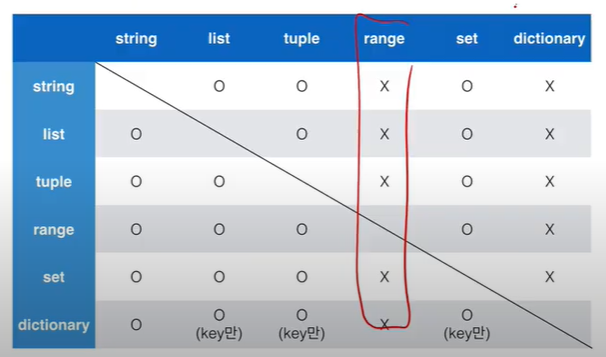

### 0117 TIL 파이썬 기본

###### 변수

`type()` : 타입

`id()` : identity

`y, x = x, y` 일케만 치면 스왑 가능 파이썬에서는

`bool([0])` : True


String의 특징 : Immutable, Iterable

String interpolation : %, format(), f-strings


`pi=3.141592`

pi:.3 은 소수점 3번째 자리에서 반올림 하는 의미 입니다. pi:.3f 를 했을 때 소수점 3번째 자리까지 나타냅니다.

`b = 1,2,3`tuple b = (1,2,3) 을 정의함




```python
a = 5 and 4 #4
b = 5 or 3 #5
c = 0 and 5 #0
d = 5 or 0 #5
```

and에서 첫번째 False면 무조건 False->첫번째 값 반환

or에서 첫번째 True면 무조건 True->첫번째 값 반환


python에서 -5~256 숫자 id 동일함

멤버십연산자 in not in 사용가능


3항연산자 `value=num if num >=0 else -num`

`[i for i in range(1,31) if 1 % 2 ==1]` 이렇게 리스트 만들기 가능

dictionary는 기본적으로 key로 순회함

`number**3 for number in range(1,4)]`