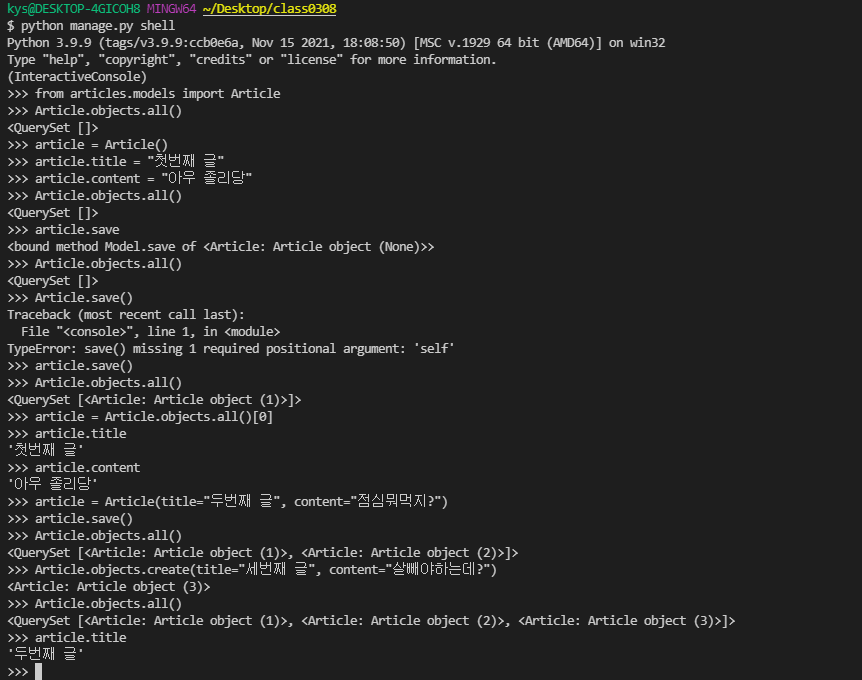

# TIL_0308

MODEL!

MTV의 M을 담당하고 있다

뭔가 데이터베이스 관련된거 하는 곳임

ORM

객체관계매핑

python으로 SQL을 감싸서 SQL안쓰고 python으로 데이터베이스를 조작

마이그레이션

python manage.py makemigrations

python manage.py migrate

python manage.py sqlmigrate articles 0001

python manage.py showmigrations

##### Create

1. 인스턴스를 만들고 save하는 방법

   article=Article()

   article.title="asdf"

   article.save()

2. 키워드 인자를 넘기는 방식

   article = Article(title="asdf")

   article.save()

3. create() 이용하는 방법

   Article.objects.create(title="asdf")

   save() 가 필요 없다

##### Read

모든 데이터 조회 : Article.objects.all()

한개 데이터 조회 : Article.objects.get() 보통 pk/id 로 찾음

조건에 맞는 데이터 조회 : Article.objects.filter()

##### Update

인덱싱으로하면됨

##### Delete

article.delete()

