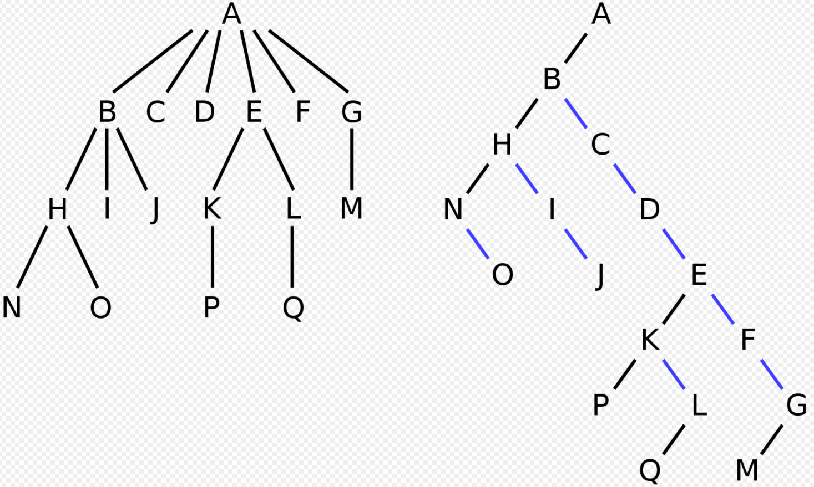

# 이진 트리

일반적으로 자식 갯수 제한은 없지만, 자식 갯수가 n>2개인 트리에서 left-child right-sibling 방법을 사용하면 equivalent한 이진 트리를 구성할 수 있으므로, 특별한 이유 없는 한 웬만한 트리는 이진트리로 구성

정 이진트리 : 모든 노드의 자식이 0개 혹은 2개

완전 이진트리 : 왼쪽에서 오른쪽으로 채운 형태, 모든 리프의 차이는 커봐야 1이고, 모든 노드는 오른쪽 자식을 갖는다면 왼쪽 자식도 가짐. 인덱스로 부모자식관계를 바로 파악할 수 있고, 공간의 낭비도 별로 없어서 리스트로 표현하기 매우 좋음

포화 이진트리 : 완전 이진트리 중 level n까지 꽉채워서, 노드의 갯수가 2^n-1이 되는 것

배열로 표현하면 쉽고 편하지만, 특정한 경우 메모리를 매우 심하게 낭비할 수 있다. 가령 1,2,3,....,10000 같은걸 이진탐색트리로 저장하는 경우를 배열로 만들려고 하면 인덱스가 2^10000까지 필요함.

# 이진트리의 순회

전위 순회 : Root-Left-Right

중위 순회 : Left-Root-Right

후위 순회 : Left-Right-Root

# 이진 탐색 트리

이진 트리의 일종으로, 노드의 왼쪽에는 노드보다 작은 값만 있고 노드의 오른쪽에는 노드보다 큰 값만 있음. 어떤 노드를 잡더라도 subtree는 이진 탐색 트리가 됨. 이진 탐색 트리를 중위순회 하면 정렬된 결과를 얻을 수 있음. 적당히 랜덤하게 배열된 값들을 받는다면 탐색/삽입/삭제에 O(logN)이 걸림. 그러나 이미 정렬된 값들을 받는다면 O(N)이 되어 비효율적일 수 있음.

최악의 상황에서도 탐색/삽입/삭제에 O(logN)이 걸린다는 red-black tree라는게 있다고는 하는데, 이런걸 자꾸 보면 벽이 느껴지죠...

# 힙 트리

완전 이진 트리의 일종, 부모의 값은 항상 자식의 값보다 큼. 대소관계는 딱 부모와 자식 사이에서만 성립함. 완전 이진트리이므로 배열로 표현하기 편리함(heapq 써도 편리하겠지만). 최댓값/최솟값을 탐색하는데 O(1)이 걸림. 삽입과 삭제는 O(logN)

삽입 : 완전이진트리의 마지막 자리에 삽입하고, 부모가 더 작다면 부모와 스왑하여 올리면 됨

삭제 : 루트 자리만 삭제할 수 있음. 루트를 제거하고, 마지막 노드를 루트로 올림. 자식보다 크다면 이대로 끝이고, 아니라면 둘 중 큰 자식과 교환하며 내려감
