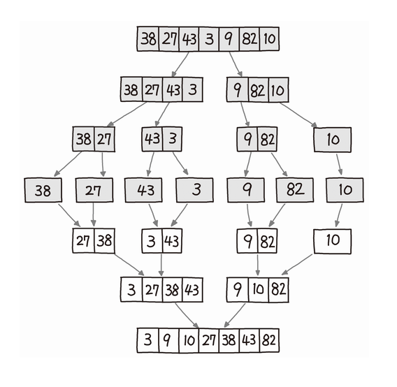

# TIL_0328


# 분할정복

크고 아름다운 문제를, 더이상 분할할 수 없을 때까지 동일한 유형의 하위 문제로 나누고(분할), 가장 작은 단위의 하위 문제를 해결(정복), 하위 문제의 결과를 원래 문제에 대한 결과로 조합한다.

보통은 재귀로 구현한다. 파이썬의 재귀는 매우 느리므로 약간 손해보는 기분이다.


# 퀵소트

1. 피벗을 정해서
2. 피벗보다 작은건 왼쪽으로, 큰건 오른쪽으로 보냄
3. 반으로 나누어진 각각의 배열에 대해 1-2를 반복
4. 배열의 크기가 1이 될때까지 진행


시간복잡도 평균적으로 nlogn, 다른 nlogn인 정렬보다 훨씬 빠르게 작동한다. 그러나 최악의 경우 O(n^2). 불안정 정렬이다.

```python
def quicksort(x):
    if len(x) <= 1:
        return x

    pivot = x[len(x) // 2]
    less = []
    more = []
    equal = []
    for a in x:
        if a < pivot:
            less.append(a)
        elif a > pivot:
            more.append(a)
        else:
            equal.append(a)

    return quicksort(less) + equal + quicksort(more)
```

피벗을 정하는 방법에 배리에이션이 매우 많고, 중간값을 정하는 방법, 랜덤하게 정하는 방법, 중간에 위치한 값을 정하는 방법, 배열 중에서 몇 개를 골라서(보통 왼쪽끝, 중간, 오른쪽끝) 그들 중 중간값으로 하는 방법 등이 있는데 각자 유리한 상황 불리한 상황이 있지만, n^2이 걸리는 요상한 입력을 주는건 진짜 어렵다고 하므로 어느정도는 믿고 써도 되는듯? 보통 배열의 중간에 위치한 값을 정하는 방법이 쉽고 편하다.


# 머지소트



우리의 본능이 이해하는 그림.jpg

O(nlogn), stable sort, 평균적인 상황에서는 퀵소트보다 느리다.

```python
def merge_sort(arr):
    if len(arr) < 2:
        return arr

    mid = len(arr) // 2
    low_arr = merge_sort(arr[:mid])
    high_arr = merge_sort(arr[mid:])

    merged_arr = []
    l = h = 0
    while l < len(low_arr) and h < len(high_arr):
        if low_arr[l] < high_arr[h]:
            merged_arr.append(low_arr[l])
            l += 1
        else:
            merged_arr.append(high_arr[h])
            h += 1
    merged_arr += low_arr[l:]
    merged_arr += high_arr[h:]
    return merged_arr
```

