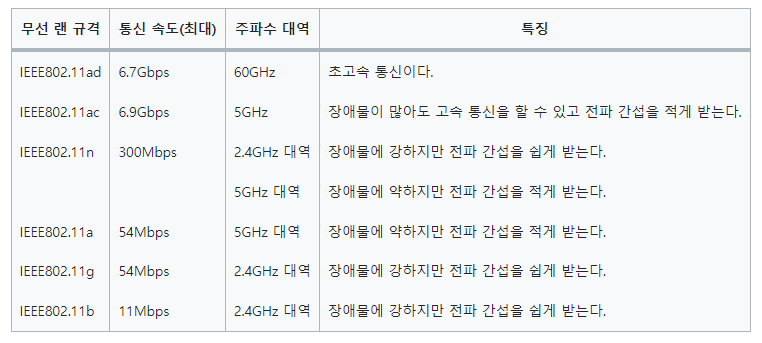

# TIL_0422

### Lesson 35. 무선 랜의 구조

무선 랜은 **액세스 포인트**와 **클라이언트**로 구성됨

컴퓨터가 무선 AP와 통신하려면 **무선 랜 칩**과 **무선 랜 어댑터**가 필요함

무선 랜을 연결하는 방식에는 **인프라스트럭쳐** 방식과 **애드 혹** 방식이 있음

인프라스트럭쳐 : 무선 액세스 포인트를 통해 통신하는 방식

애드 혹 : 클라이언트끼리 직접 통신하는 방식

무선 랜 규격은 IEEE802.11을 준수함. 그 중 현재에는 11n또는 11ac를 주로 사용함

### Lesson 36. SSID의 구조

SSID : 액세스 포인트의 고유 이름

그리고 네트워크 이름, 인증, 암호화, 암호화 키를 설정해야 함

액세스 포인트와 클라이언트의 연결 과정

1. 무선 액세스 포인트는 비컨을 주기적으로 전송한다
2. 같은 SSID인지 문의한다
3. 같은 SSID라고 응답한다
4. 인증을 주고받는다
5. 인증이 올바르면 접속을 요청하고 승인받아 통신한다

채널 : 공유기를 여러 개 설치하면 각자 주파수가 다르다. 그 주파수 대역을 채널이라고 부름.

주파수 대역이 겹치면 전파 간섭이 발생.

상식) 2.4Ghz Wifi에서 채널은 5Mhz 간격이지만, 간섭을 피하기 위해 25Mhz이상 띄우는걸 권장함.