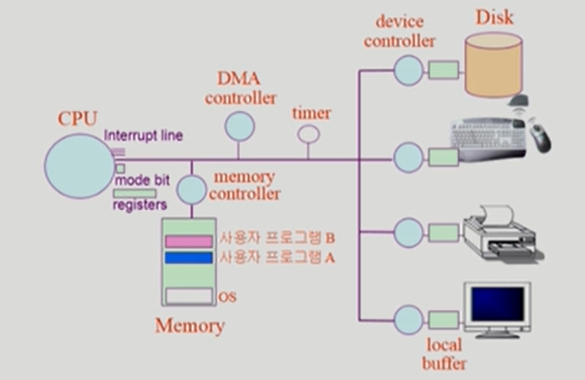

# TIL_0503

# System Structure & Program Execution

운영체제를 설명하기에 앞서 하드웨어에 대해 설명

인터럽트 라인 : CPU는 메모리랑만 노는데, 다른 애가 일 끝냈는지 알려고

mode bit : 지금 실행되는게 운영체제(0)인지 사용자 프로그램(1)인지

mode bit이 0일때는 cpu는 뭐든지다할수있음, 1일때는 제한된 동작만 가능(I/O 접근은 안됨)

타이머 : 일정 시간간격마다 인터럽트를 걸어줌