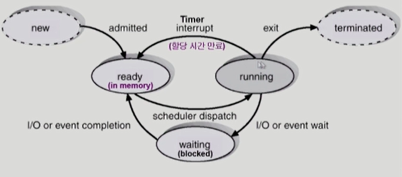
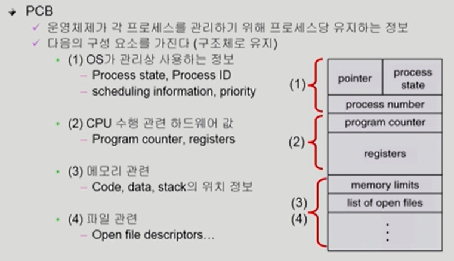

# TIL_0504

# Chapter 3. Process

Process is a program in execution

프로세스의 문맥 : 프로세스의 현재 상태를 나타내는데 필요한 모든 요소

1. 하드웨어 문맥 : 레지스터가 무슨 값인가, 프로그램 카운터가 어딜 가리키고있는가
2. 프로세스의 주소 공간
3. 프로세스 관련 커널 자료 구조

프로세스의 상태

1. Running : CPU를 잡고 instruction을 수행중인 상태
2. Ready : CPU를 기다리는 상태(메모리 등 다른 조건을 모두 만족하고)
3. Blocked(wait, sleep) : 당장 instruction을 수행할 수 없는 상태 ex) 디스크에서 파일을 읽어와야 하는 경우
4. (New) : 프로세스가 생성 중인 상태
5. (Terminated) : 수행이 끝난 상태(종료 중인 상태)
5. Suspended : 뒤에서 설명

**문맥 교환**

CPU를 한 프로세스에서 다른 프로세스로 넘겨주는 과정

1. CPU를 내어주는 프로세스의 상태를 그 프로세스의 PCB에 저장함
2. CPU를 새롭게 얻는 프로세스의 상태를 PCB에서 읽어옴

System call이나 Interrupt가 생긴다고 반드시 context switch가 일어나는 것은 아님. 물론 일부 context를 PCB에 저장하긴 해야한다고함

Kernel mode 이후 프로세스가 바뀔때만 일어남(ex : timer interrupt, I/O 요청 system call). 이때는 캐시메모리를 날려야하므로 오버헤드가 크다

**스케줄러**

Long-term scheduler(job scheduler)

- 시작 프로세스 중 어떤 것들을 ready queue로 보낼지 결정
- 프로세스에 memory를 주는 문제
- degree of multiprogramming(쉽게 말하면, 메모리에 프로그램 몇개 올릴지) 제어
- time sharing system에는 보통 장기 스케줄러가 없음(무조건 ready)

Short-term scheduler(CPU scheduler)

- 어떤 프로세스를 다음번에 running시킬지 결정
- 프로세스에 CPU를 주는 문제
- 충분히 빨라야 함 (ms단위)

Medium-term scheduler(swapper)

- 시분할 시스템의 degree of Multiprogramming을 제어
- 여유 공간 마련을 위해 프로세스를 메모리에서 디스크로 쫓아냄

- 위의 6. suspended : 외부적인 이유로 프로세스의 수행이 정지된 상태(메모리에 너무 많은 프로세스가 올라와 있을 때 디스크로 swap out)

  blocked는 자신이 요청한 event가 만족되면 ready, suspended는 외부에서 resume해주어야 active

**쓰레드 **

프로그램 실행의 단위. 같은 일을 하는 프로세스 여러개 띄우고 싶을 때, 주소공간 하나만 만들고 각 쓰레드마다 프로그램의 다른 구간을 수행할 수 있도록 하면 됨.

쓰레드의 구성 : program counter, register set, stack space

공유하는 부분(=task) : code, data, OS resources

쓰레드를 사용하면 응답성이 빨라지고, 자원을 공유할 수 있고, 경제적(빠름), multiprocessor 환경에서 병렬처리

커널쓰레드 vs 유저쓰레드
