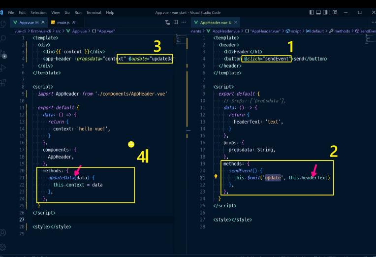

# TIL_0510

v-on(@) : addEventListener 같은거 

v-bind(:) : Vue의 데이터 속성으로 쓰고싶으면

v-model : 입력을 받는 태그에 쓰면, 입력 값이 자동으로 뷰 데이터와 연결됨

computed : 어떤 값이 변경되었을 때 새로운 값을 생성하거나 변경

watch : 값이 변할때마다 이전 값으로 뭔가 하고싶을때

props : 상위->하위로 데이터 내릴 때

event : 하위->상위로 데이터 올릴 때

 samelevel : event로 루트로 올리고, props로 내려서 주고받음

컴포넌트 안에서 데이터는 함수 형태로 정의해서 리턴 객체 한다.

vue create first-vue-cli

npm run serve
