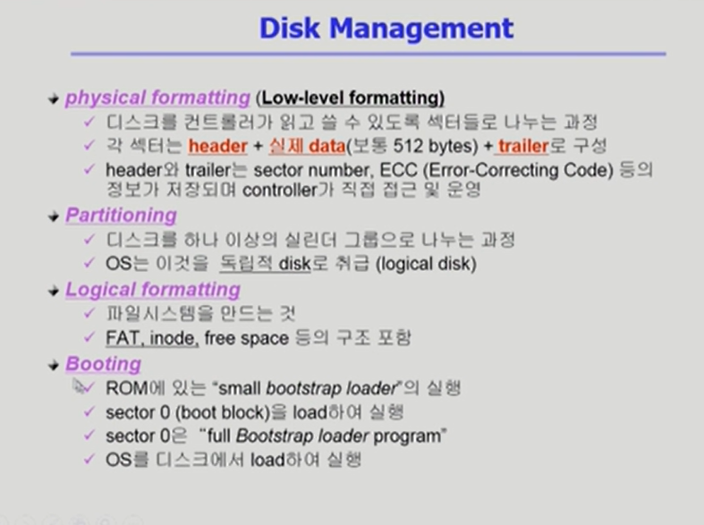
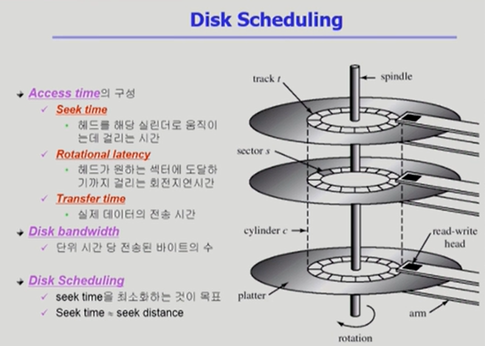
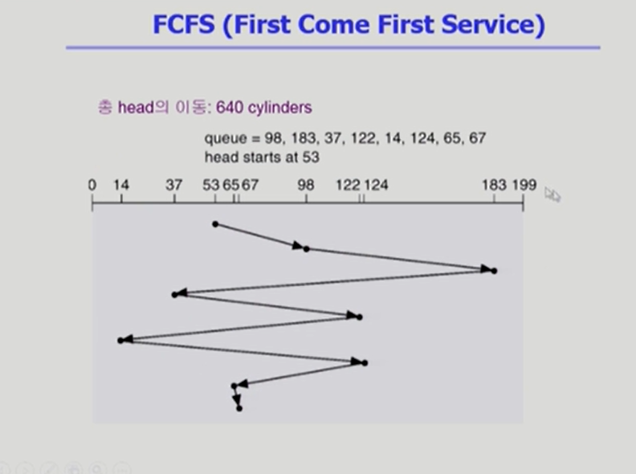
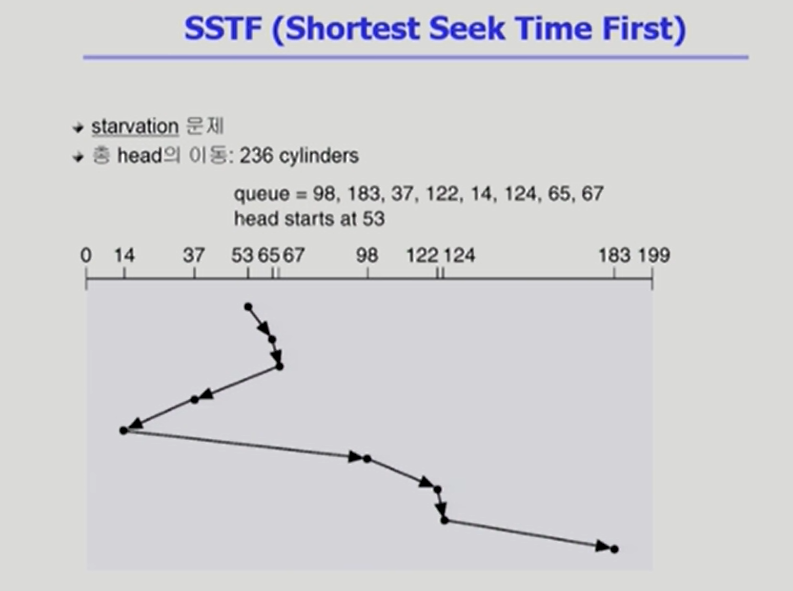
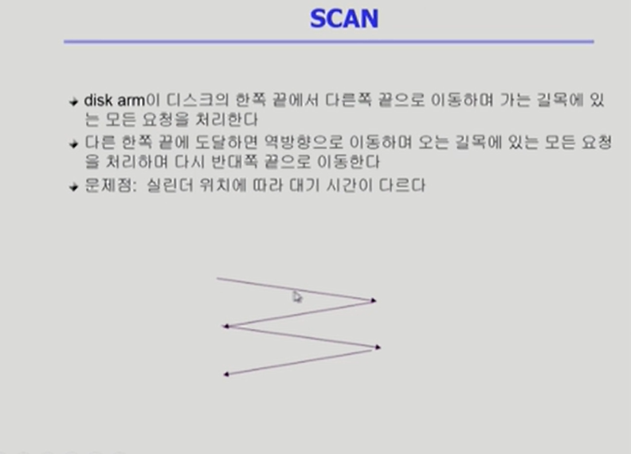
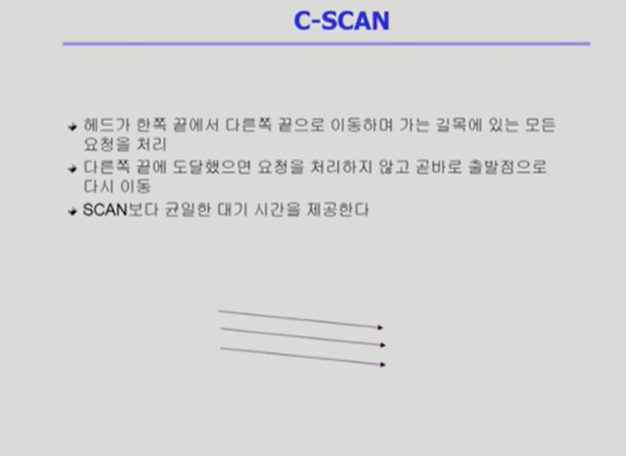
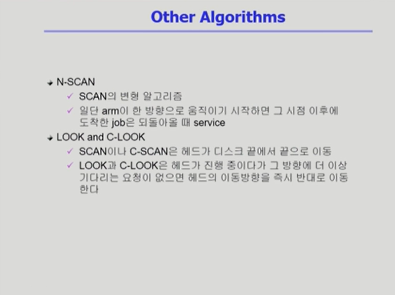
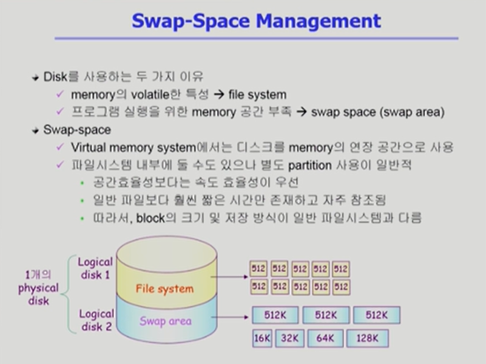
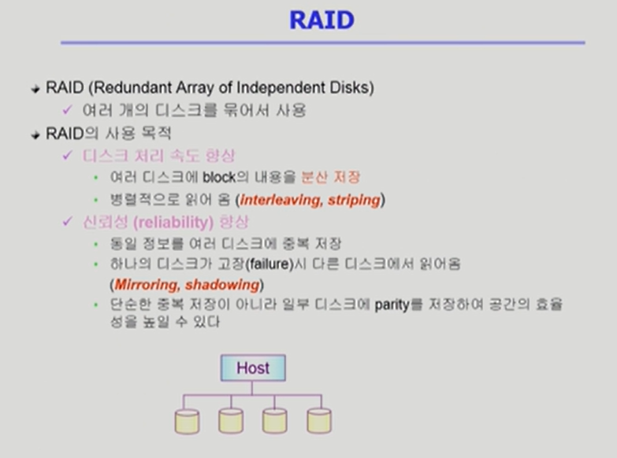

# TIL_0609

## Ch11. Disk Management and Scheduling

**Disk Structure**

- logical block : 

  디스크의 외부에서 보는 디스크의 단위 정보 저장 공간들

  주소를 가진 1차원 배열처럼 취급

  정보를 전송하는 최소 단위

- sector : Logical block이 물리적인 디스크에 매핑된 위치

  0번 섹터는 당연히 최외곽 실린더의 첫 트랙에 있는 첫 번째 섹터, 여기에 부트로더가 들어감

**Disk Scheduling Algorithm**

FCFS, SSTF, SCAN, C-SCAN, N-SCAN, LOOK, C-LOOK

