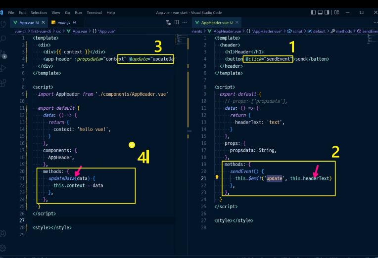

# Vue

[TOC]

## TIL_0510

v-on(@) : addEventListener 같은거 

v-bind(:) : Vue의 데이터 속성으로 쓰고싶으면

v-model : 입력을 받는 태그에 쓰면, 입력 값이 자동으로 뷰 데이터와 연결됨

computed : 어떤 값이 변경되었을 때 새로운 값을 생성하거나 변경

watch : 값이 변할때마다 이전 값으로 뭔가 하고싶을때

props : 상위->하위로 데이터 내릴 때

event : 하위->상위로 데이터 올릴 때

 samelevel : event로 루트로 올리고, props로 내려서 주고받음

컴포넌트 안에서 데이터는 함수 형태로 정의해서 리턴 객체 한다.

vue create first-vue-cli

npm run serve

mutation : commit, 비동기작업x

action : dispatch, 비동기작업o

vue에서 $의 의미 : public 속성

반대로 _의 의미 : private 속성

mapState, mapGetters, mapActions... 등으로 index.js에 정의한거 직접 사용 가능

## TIL_0516

View : DOM(HTML)

Model : JS Object

ViewModel : Vue Instance

v-show : 보인다/안보인다

v-if : 있다/없다

v-for>v-if 우선순위

computed : 특정 값이 변동되면 다시 계산해서 리턴,

watch : 특정 값이 변동하면 콜백 함수를 트리거, computed로 가능한 논리는 computed로 하는게 좋다.

created : 'vue instance' 가 생성된 후에 호출됨

history모드 : 브라우저의 히스토리는 남기지만 실제 페이지는 이동하지 않는 기능. SPA의 단점 중 하나인

URL이 변경되지 않는다를 해결.
