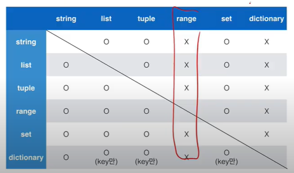

# Python

[TOC]

## 0115 사전학습 - 파이썬

```python
dan = int(input("단을 입력하세요 : "))
for i in (1,2,3,4,5,6,7,8,9):
    print("{0} * {1}= {2:>2}".format(dan,i,dan*i))
```

**{0:<10}** 이 뜻하는 것은 **{0} 값**을 ":<10" 10자리로 표현할건데 왼쪽 정렬을 할 것이다. 라는 뜻 이고
**{1:>5}** 가 뜻하는 것은 **{1} 값**을 ":>5" 5자리로 표현할건데 오른쪽 정렬을 할 것이다. 입니다.

**왼쪽 정렬에는 기호 <** 를 사용하고, **오른쪽 정렬에는 >**, **가운데 정렬에는 ^**를 사용합니다.

<, >, ^ 기호 앞에 특정 문자를 입력하면 공백 부분이 다른것으로 채워지는걸 볼 수 있습니다.

출처: https://blockdmask.tistory.com/424 [개발자 지망생]


입력포맷 %와 d사이의 숫자는 공백을 의미한다


```python 
dogs = {1:"골든리트리버", 2:"치와와", 3:"보더콜리"}

for key in dogs:
    print("{0} : {1}".format(key, dogs[key]))
    
for key, value in dogs.items():
    print("{0} : {1}".format(key,value))
```

items 함수는 Key와 Value의 쌍을 튜플로 묶은 값을 dict_items 객체로 돌려준다.

0.2f = 소숫점 둘째자리까지 표시하는 float


## 0116 사전학습 - 파이썬

`def calc_sum(*params):`

*:언팩 연산자 : 매개변수에 인자 값들이 튜플 형식으로 입력

**:키워드 언팩 연산자 : 딕셔너리 형식으로 입력

` def calc(x,y,operator="+")`

operator 뒤에있는거=매개변수 입력 안됐으면 +를 기본값으로 갖겠다는 뜻


리스트 뒤집기[::-1] (처음부터, 끝까지, 역순으로)


### 내장함수

divmod(9,5)=(1,4) ->몫과 나머지를 튜플로 반환

enumerate -> 시퀀스를 입력받아 인덱스를 포함하는 튜플 객체를 항목으로 구성하는 enumerate 개체를 반환

zip -> 둘 이상의 반복가능한 자료형을 전달받아 동일 위치의 항목을 묶어 튜플을 항목으로 구성하는 zip 개체를 반환(그니깐 인자들은 length가 동일하야겠지)

chr() : 유니코드 -> 문자

ord() : 문자 -> 유니코드

hex() : 10진 정수->16진 정수

dir() : ~~인자로 전달된 객체의 변수, 메서드 등 속성을 리스트로 반환~~

~~인자를 전달하지 않으면 현재 지역 스코프에 대한 정보를 리스트로 반환~~

globals(), locals()

id()


items() : 딕셔너리 받아서 Key,Value 튜플 반환

split() : 문자열 받아서 공백단위 구분 리스트 반환

eval() : 문자열 받아서 실행결과 반환

map() : 연산 끼얹음

fliter() : 알것같음


### 예외처리

try ~ except : 예외 발생시

try ~except ~ else : 예외 발생시+ 예외 발생 않을시

try ~ except ~ else ~ finally : 예외 발생시 + 예외 발생 않을시 + 예외유무와 상관없이


### 객체지향


## 0117 파이썬 기본

**변수**

`id()` : identity

`y, x = x, y` 일케만 치면 스왑 가능 파이썬에서는


String의 특징 : Immutable, Iterable

String interpolation : %, format(), f-strings


`pi=3.141592`

pi:.3 은 소수점 3번째 자리에서 반올림 하는 의미 입니다. pi:.3f 를 했을 때 소수점 3번째 자리까지 나타냅니다.

`b = 1,2,3`tuple b = (1,2,3) 을 정의함





python에서 -5~256 숫자 id 동일함

멤버십연산자 in not in 사용가능


3항연산자 `value=num if num >=0 else -num`

`[i for i in range(1,31) if i % 2 ==1]` 이렇게 리스트 만들기 가능

`number**3 for number in range(1,4)]`


## TIL_0118

**기본문법**

triple quotes : 개행문자 없이 줄바꿀 때, 안에 따옴표 넣을 때 쓴다

산술연산자 +, * : 시퀀스 간의 concatenation

enumerate() : start idx 정할 수 있음


## TIL_0119

```python
def minus_and_product(x,y):
    return x-y, x*y
```

이거 **튜플**로 (x-y, x*y) 반환함. 리턴값 한개임!


```python
def function(ham): # parameter : ham
    return ham

function('spam') # argument : 'spam'
```

Parameter : 식별자

Argument : 넣어주는 값


기본 argument 값을 가지는 argument를 먼저 쓸 수 없음

LEGB : Local Enclosed Global Built in

scope global : 전역

​			nonlocal : 자기 포함하는(enclosed) 함수까지


filter=iterable에 함수 적용하고 결과가 true인 것만 반환


## TIL_0120

모듈, 패키지, 가상환경 -> 슬라이드에 잘 돼있음

pull -> 작업 -> add -> commit -> pull -> push


## TIL_0123

```python
import json

file_stream = open('data/data.json','r',encoding='UTF-8')
data=json.load(file_stream)
print(type(data[0]))
file_stream.close() # 닫아줘야함. 이유는 모르겠지만 닫아줘야함

```

json 공부 해야하나??? 안해도될것같긴함

string interpolation 3개 일단 f가 제일 쉬움


## TIL_0124

함수의 아규먼트가 [ ] 일케 돼있으면 리스트 넣으란뜻x optional 이란 뜻임

```python
a=1,2,3 #(a,b,c)

b,c,d=a #1,2,3
```


## TIL_0125

.strip() 문자열을 지정하지 않으면 공백을 제거함

' ' '\t' '\n' 모두 제거함

```python
a=(1) # 숫자 1
a= 1, # 원소 한개짜리 튜플
```


## TIL_0126

```python
class MyClass:
    #인스턴스 메서드 : 인스턴스를 조작하고싶어
    #그니깐 인스턴스를 던져줘야지
    #메서드를 정의할 때 self로 받도록
    
    def instance_method(self):
        return self
    
    #클래스 메서드 : 클래스를 조작하고싶어
    #그니깐 클래스를 던져줘야지
    #메서드를 정의할 때 cls로 받도록
    @classmethod
    def class_method(cls):
        print(cls.var)
        return cls
    
    #스태틱 메서드 : 클래스나 인스턴스를 조작할 생각은 없는데 함수를 쓸거야
    @staticmethod
    def static_method():
        return ''
```


## TIL_0127

데코레이터 : 함수를 받아서 꾸미고 함수를 리턴

```python
def time_display_decorator(origin_func):
    def decorated():
        print(dt.now())
        origin_func()
        print('----')
    return decorated
@time_display_decorator
def test_a():
    print('test_a')
@time_display_decorator
def test_b():
    print('test_b')
test_a() # time_display_decorator(test_a)()
        # time_display_decorator()
test_b()
```


sum([int(i) for i in str(i)])

이렇게 하면  i의 자리합을구할수있음


if '666' in str(i) 이거 가능함 ㅋㅋ;;;
